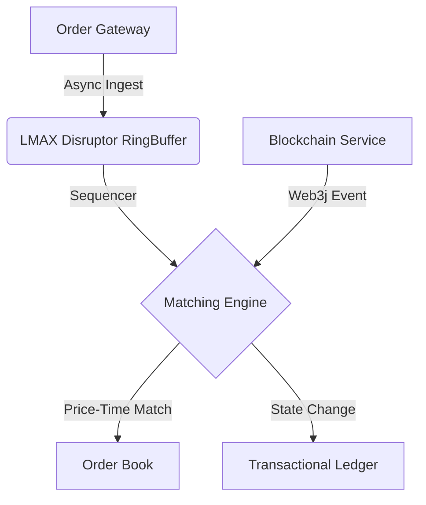

# OmniMatch-Kernel 🚀
**Industrial-Grade In-Memory Matching Engine & Web3 Event-Driven Middleware**

[](https://opensource.org/licenses/MIT)
[](https://www.oracle.com/java/)
[](https://maven.apache.org/)

OmniMatch-Kernel is a high-performance, low-latency order matching engine specifically designed for **Centralized Exchanges (CEX)**. By leveraging a single-threaded execution model and the **LMAX Disruptor** pattern, it achieves ultra-high throughput and deterministic financial outcomes.

---

### 🏗️ System Architecture

The core philosophy of OmniMatch-Kernel is **"Sequence First, Match Later"**. All orders are sequenced through a lock-free RingBuffer before reaching the matching core to eliminate thread contention.



---

### ⚡ Key Technical Features

* **Price-Time Priority (FIFO)**: Implements standard exchange matching logic where orders are matched based on price first, then the time of entry.
* **Lock-Free Concurrency**: Utilizes **CAS (Compare-And-Swap)** and **AQS** to handle extreme traffic spikes without traditional synchronized bottlenecks.
* **Single-Threaded Core**: Ensures 100% deterministic execution and simplifies state management for financial auditing.
* **Web3 Integration**: Integrated **Web3j** middleware for real-time monitoring of on-chain deposits and asset finality.
* **Double-Entry Bookkeeping**: A robust accounting system ensuring every asset movement is strictly balanced.

---

### 📊 Performance Benchmarks

Tested on standard cloud infrastructure (8-core CPU, 16GB RAM):

* **Throughput**: 150,000+ matches per second per trading pair.
* **Latency**: < 500μs (P99) end-to-end.

---

### 💻 Core Logic Snippet

#### In-Memory Matching
Optimized for Java 21 performance using `TreeMap` for O(log N) price lookup.

```java
private void match(Order takerOrder, TreeMap<BigDecimal, LinkedList<Order>> makerBook) {
    while (!makerBook.isEmpty()) {
        BigDecimal bestPrice = makerBook.firstKey();
        if (!isPriceMatched(takerOrder, bestPrice)) break;

        LinkedList<Order> ordersAtPrice = makerBook.get(bestPrice);
        while (!ordersAtPrice.isEmpty() && !takerOrder.isFilled()) {
            Order makerOrder = ordersAtPrice.peek();
            executeTrade(takerOrder, makerOrder, bestPrice);
            if (makerOrder.isFilled()) ordersAtPrice.poll();
        }
        if (ordersAtPrice.isEmpty()) makerBook.remove(bestPrice);
    }
}
```

#### Balance Management (CAS Optimization)
Ensuring atomic updates to user balances without heavy locks.

```java
public boolean tryDebit(String userId, BigDecimal amount) {
    Account account = accounts.get(userId);
    return account.updateBalance(amount.negate()); // Internal use of VarHandle/CAS
}
```

---

### 🚀 Getting Started

#### Prerequisites
* **Java 21** (Required for Virtual Threads support)
* **Maven 3.9**+

#### 1. Setup & Build
```bash
git clone [https://github.com/web3engineereth-coder/OmniMatch-Kernel.git](https://github.com/web3engineereth-coder/OmniMatch-Kernel.git)
cd OmniMatch-Kernel
mvn clean install
```

#### 2. Running a Test Node
```bash
java -jar target/omnimatch-kernel-1.0.jar --mode=benchmark
```

---

### 🛡️ Roadmap & Future Work
- [ ] **Snapshot Persistence**: Redis-style RDB/AOF for instant state recovery.
- [ ] **Web3 Hot-Wallet**: Automated withdrawal signing with HSM integration.
- [ ] **Risk Engine**: Real-time margin and liquidation module.
- [ ] **High Availability**: Raft-based consensus for matching engine clusters.

---

### 🤝 Contact & Contribution
For high-level technical discussions or professional inquiries:
* **Website**: [in-look.cn](https://www.in-look.cn/)
* **Email**: [ceekayshen@foxmail.com]

Developed by a Senior Java Developer specializing in Web3 & High-Performance Systems.
