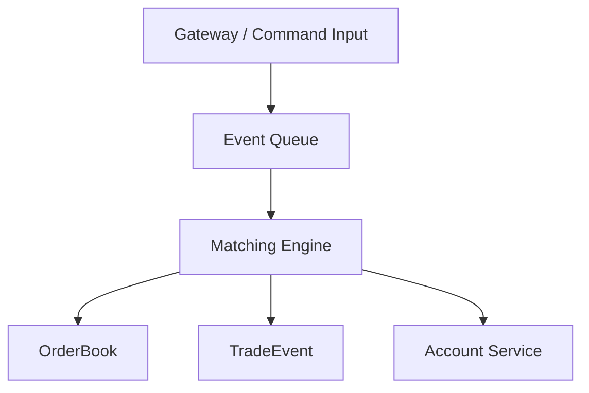
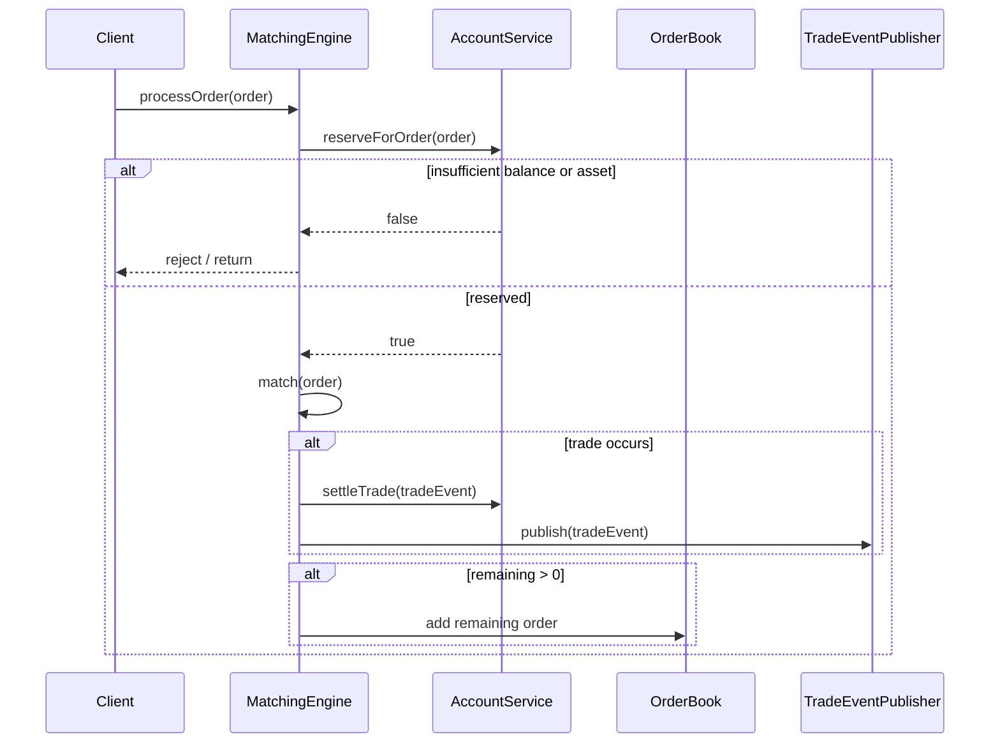
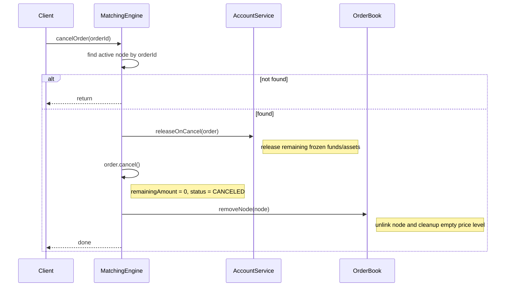

# OmniMatch-Kernel 🚀

**Deterministic In-Memory Matching Engine for CEX-Style Trading Systems**

OmniMatch-Kernel is a high-performance in-memory matching engine designed for **Centralized Exchange (CEX)** style systems.

It focuses on:

* deterministic matching
* low-latency order book operations
* correctness of order lifecycle and account transitions

---

## 🏗️ Architecture Overview

> Sequence first, match later.

```mermaid
graph TD
    A[Gateway / Command Input] --> B[Event Queue]
    B --> C[Matching Engine]
    C --> D[OrderBook]
    C --> E[TradeEvent]
    C --> F[Account Service]
```

---

## ⚡ Core Design Principles

### 1. Single-Threaded Deterministic Matching

The matching core is strictly single-threaded:

* no locks on the critical path
* strict ordering guarantee
* deterministic execution result
* easier financial correctness reasoning

### 2. Node-Based Order Book

The order book is built with:

* `TreeMap` for price index
* `PriceLevel` for FIFO queue per price
* `OrderNode` for intrusive linked structure
* `orderMap` for `orderId -> OrderNode` lookup

This supports:

* O(1) cancel after lookup
* FIFO at the same price level
* efficient best bid / best ask lookup
* automatic empty level cleanup

### 3. Price-Time Priority

Matching follows standard exchange rules:

* price priority
* time priority (FIFO)

---

## 🔄 Trading Lifecycle (Critical Path)

```mermaid
sequenceDiagram
    participant Client
    participant Engine as MatchingEngine
    participant Account as AccountService
    participant Book as OrderBook
    participant Event as TradeEventPublisher

    Client->>Engine: processOrder(order)
    Engine->>Account: reserveForOrder(order)

    alt insufficient balance or asset
        Account-->>Engine: false
        Engine-->>Client: reject / return
    else reserved
        Account-->>Engine: true
        Engine->>Engine: match(order)

        alt trade occurs
            Engine->>Account: settleTrade(tradeEvent)
            Engine->>Event: publish(tradeEvent)
        end

        alt remaining > 0
            Engine->>Book: add remaining order
        end
    end
```

---

## ❌ Cancel Flow (Important Invariant)

> Correct order: **release → cancel → remove**

```mermaid
sequenceDiagram
    participant Client
    participant Engine as MatchingEngine
    participant Account as AccountService
    participant Book as OrderBook

    Client->>Engine: cancelOrder(orderId)
    Engine->>Engine: find active node by orderId

    alt not found
        Engine-->>Client: return
    else found
        Engine->>Account: releaseOnCancel(order)
        Note right of Account: release remaining frozen funds/assets

        Engine->>Engine: order.cancel()
        Note right of Engine: remainingAmount = 0, status = CANCELED

        Engine->>Book: removeNode(node)
        Note right of Book: unlink node and cleanup empty price level

        Engine-->>Client: done
    end
```

### Why this order matters

`releaseOnCancel()` depends on `remainingAmount`.

If cancel happens first, then:

* `remainingAmount` becomes `0`
* release amount becomes incorrect
* frozen funds or assets may not be released properly

---

## 💰 Account Lifecycle (Minimal Model)

Account state is modeled as:

* `availableCash`
* `frozenCash`
* `availableAsset`
* `frozenAsset`

Lifecycle:

| Stage        | Action                          |
| ------------ | ------------------------------- |
| Order Submit | freeze funds or assets          |
| Trade        | settle between buyer and seller |
| Cancel       | release remaining frozen amount |

---

## 🧠 System Invariants

### 1. Best Price Correctness

* `bestBid = max(buy side)`
* `bestAsk = min(sell side)`

### 2. OrderBook Consistency

* `orderMap` and order book nodes must stay consistent
* no dangling node should remain in any price level

### 3. Lifecycle Integrity

* `remainingAmount == 0` → order must be removed
* `remainingAmount > 0` → active order must still exist

### 4. No Ghost Orders

Canceled or fully filled orders must not remain in:

* `orderMap`
* price levels
* active order queries

### 5. Empty Level Cleanup

* empty `PriceLevel` must be removed immediately

---

## 🧪 Test Coverage

Current tests validate:

* best bid / best ask correctness
* FIFO matching
* O(1) cancel behavior
* partial fill lifecycle
* cancel + release correctness
* orderMap vs orderBook consistency
* invariant-oriented correctness scenarios

---

## 🛣️ Roadmap

* [ ] Invariant Guard (runtime validation)
* [ ] Multi-symbol routing
* [ ] Disruptor single-consumer pipeline
* [ ] Snapshot and recovery
* [ ] Risk engine boundary

---

## 🧩 Summary

OmniMatch-Kernel focuses on:

> building a minimal, verifiable matching + account model with strong correctness guarantees

It is not intended to be a full exchange implementation yet. The current emphasis is on:

* deterministic matching
* correct order lifecycle
* correct account transitions
* testable system invariants

---

## 📬 Contact

* GitHub: https://github.com/web3engineereth-coder

* **Website**: [in-look.cn](https://www.in-look.cn/)
* **Email**: [ceekayshen@foxmail.com](mailto:ceekayshen@foxmail.com)

Developed as a production-like matching engine prototype for exploring **high-performance trading infrastructure**, **deterministic order matching**, and **Web3-adjacent exchange system design**.
