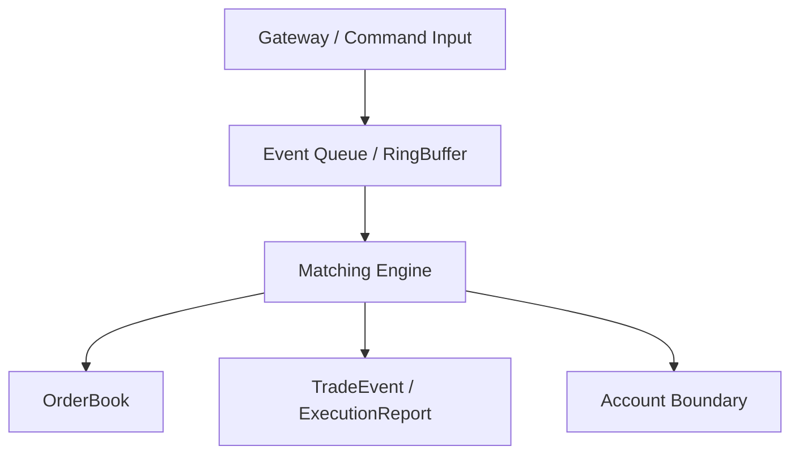

# OmniMatch-Kernel 🚀

**Deterministic In-Memory Matching Engine for CEX-Style Trading Systems**

[](https://opensource.org/licenses/MIT)
[](https://www.oracle.com/java/)
[](https://maven.apache.org/)

OmniMatch-Kernel is a high-performance, low-latency in-memory matching engine designed for **Centralized Exchange (CEX)** style trading systems.

It focuses on three core goals:

* **deterministic matching**
* **low-latency order book operations**
* **production-like engineering clarity**

The engine uses a **single-threaded matching core** together with an **event-driven pipeline** to preserve strict execution order while keeping the matching path minimal and predictable.

---

## 🏗️ Architecture Overview

The core design principle is:

> **Sequence first, match later.**

External requests are normalized into internal commands before entering the matching core.
The matching engine processes commands in order and keeps the critical path focused on matching correctness and state transitions.


```mermaid
graph TD
    A[Gateway / Command Input] --> B[Event Queue / RingBuffer]
    B --> C[Matching Engine]
    C --> D[OrderBook]
    C --> E[TradeEvent / ExecutionReport]
    C --> F[Account Boundary]
```

### Core boundaries

* **Gateway / Command Input**

    * accepts external requests
    * normalizes them into internal commands
    * isolates the matching core from protocol-specific concerns

* **Matching Engine**

    * maintains deterministic order processing
    * executes price-time priority matching
    * updates order lifecycle state
    * emits trade / execution events

* **OrderBook**

    * maintains bid / ask books
    * supports efficient best price lookup
    * supports node-level removal for cancel and full fill

* **Account Boundary**

    * kept as a minimal service boundary in the current phase
    * separates matching logic from settlement / balance concerns

---

## ⚡ Implemented Features

### 1. Price-Time Priority Matching

Orders are matched using standard exchange rules:

* **price first**
* **time second**

This ensures predictable FIFO behavior within each price level.

---

### 2. Single-Threaded Deterministic Core

The matching core is intentionally kept **single-threaded** to preserve:

* strict ordering
* deterministic state transitions
* simpler lifecycle correctness
* easier reasoning for financial workflows

This is a deliberate trade-off in favor of correctness and consistency on the matching path.

---

### 3. Node-Based Order Book Structure

The order book has been refactored into the following model:

* `OrderBook`
* `PriceLevel`
* `OrderNode`
* `orderMap`

This structure enables:

* indexed order lookup via `orderId -> OrderNode`
* O(1) cancel path after lookup
* stable partial fill behavior without node relocation
* correct cleanup of empty price levels

---

### 4. O(1) Cancel Path

Cancel operations are optimized around:

* direct node lookup from `orderMap`
* intrusive double-linked list removal
* immediate price level cleanup when empty

This avoids order-book scans and keeps cancel latency independent of order-book depth after index lookup.

---

### 5. Partial Fill Lifecycle

For partial fills, the engine follows a **state update first, structure remains stable** principle:

* update `remainingQty`
* transition state to `PARTIALLY_FILLED`
* keep the node in the same `PriceLevel` position

Only fully filled orders are physically removed from the order book.

---

### 6. Explicit Order Lifecycle

The engine models order lifecycle explicitly with clear state transitions such as:

* `NEW`
* `PARTIALLY_FILLED`
* `FILLED`
* `CANCELED`

This makes lifecycle behavior easier to reason about and test.

---

## 🧠 Core Data Structure

The matching core is centered around a node-based order book design.

### Order book model

* **price index**: `TreeMap`
* **price bucket**: `PriceLevel`
* **queue node**: `OrderNode`
* **global lookup**: `orderMap`

### Why this structure

This design supports:

* efficient best bid / best ask lookup
* FIFO order preservation within a price level
* O(1) node unlink for cancel / full fill
* clean separation between price-level structure and order lifecycle state

---

## 💻 Core Matching Logic

### Partial fill behavior

Partial fills update state and quantity without restructuring the book:

```java
if (matchedQty.compareTo(orderNode.getRemainingQty()) < 0) {
    orderNode.fill(matchedQty); // remainingQty reduced, state becomes PARTIALLY_FILLED
    // node stays in current price level
}
```

### Full fill behavior

Fully filled nodes are removed from both the linked structure and the global index:

```java
orderNode.fill(matchedQty);
if (orderNode.isFilled()) {
    orderBook.removeNode(orderNode);
    orderMap.remove(orderNode.getOrderId());
}
```

### Cancel path

Cancels use direct lookup + node unlink:

```java
OrderNode node = orderMap.remove(orderId);
if (node != null) {
    node.cancel();
    orderBook.removeNode(node);
}
```

---

## ✅ Current Test Coverage Focus

The current codebase includes focused tests around matching-core correctness, including:

* order insertion into the book
* best bid / best ask updates
* O(1)-style cancel behavior via indexed lookup
* partial fill lifecycle behavior
* full fill cleanup
* empty `PriceLevel` cleanup

---

## 🚀 Getting Started

### Prerequisites

* **Java 21**
* **Maven 3.9+**

### Build

```bash
mvn clean test
mvn clean package
```

### Run tests

```bash
mvn test
```

### Run the local demo

```bash
java -cp target/classes cn.inlook.cex.OmniMatchDisruptorApp
```

---

## 🛣️ Roadmap

The current repository focuses on **matching-core correctness and structure**.

Planned next steps may include:

* [ ] Trade event publishing boundary refinement
* [ ] Cleaner async event pipeline
* [ ] Symbol-based command routing
* [ ] Minimal account freeze / release model
* [ ] Snapshot / recovery improvements
* [ ] Risk-engine boundary expansion

---

## 🤝 Contribution

Contributions, reviews, and discussion are welcome.

When contributing, please keep changes aligned with the current project priorities:

* deterministic matching
* minimal matching-core critical path
* readable, reviewable engineering structure

---

## 📬 Contact

* **Website**: [in-look.cn](https://www.in-look.cn/)
* **Email**: [ceekayshen@foxmail.com](mailto:ceekayshen@foxmail.com)

Developed as a production-like matching engine prototype for exploring **high-performance trading infrastructure**, **deterministic order matching**, and **Web3-adjacent exchange system design**.
